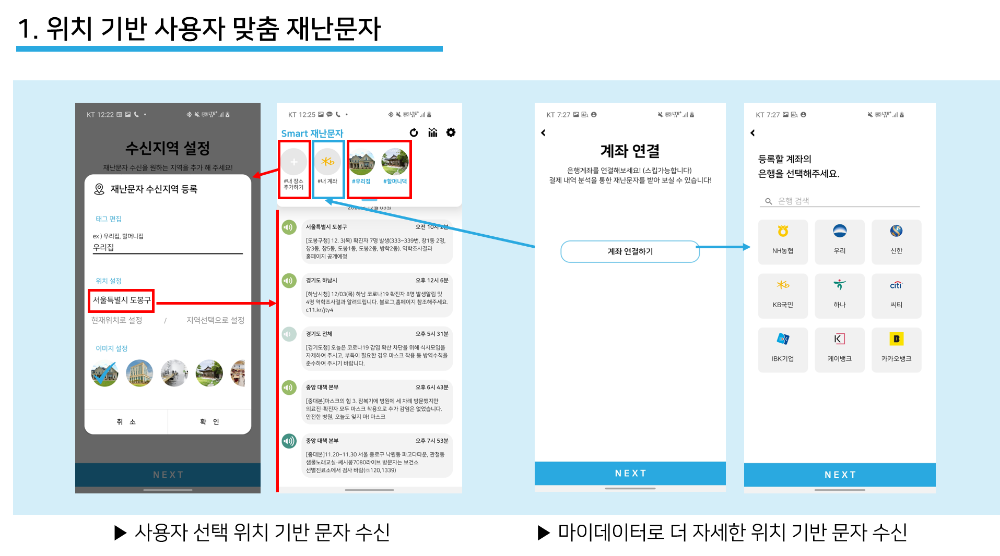
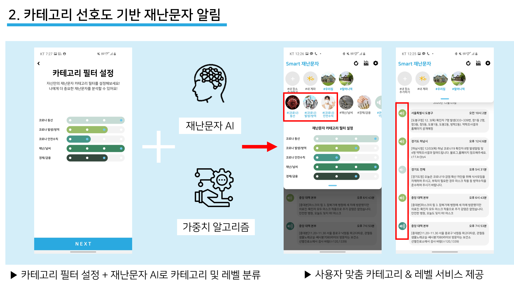
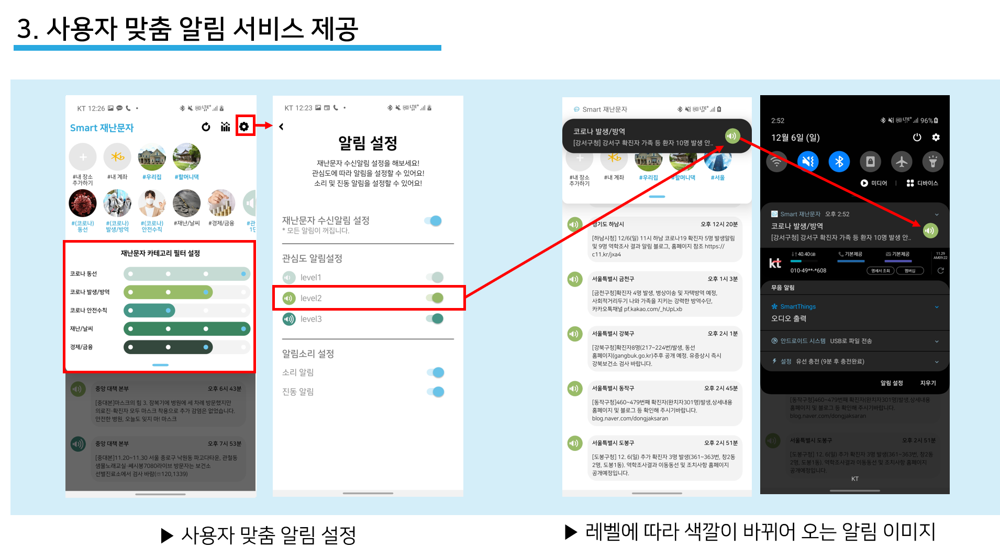
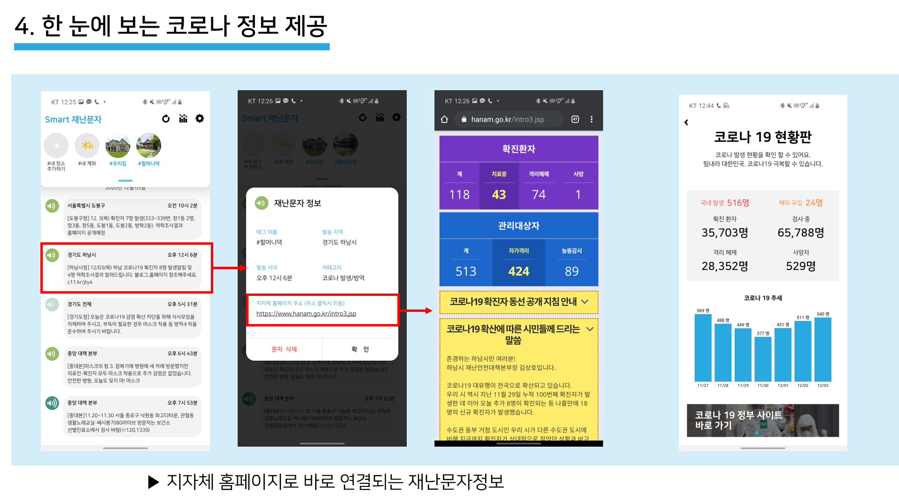
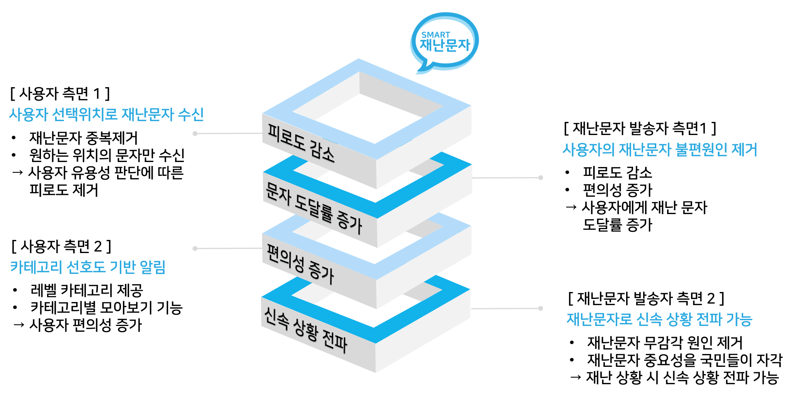

<h1 align="center">Smart 재난문자</h1>

Author : Moeun Son, SangByuk Jeong, Unann Lee

Date: December 6, 2020

</img>
## ❤️사회현안

1. 재난문자 순신양의 급증
2. 재난문자 발송 방식의 단점 : 위치적으로 연관 없는 재난 문자 수신
3. 재난문자 카테고리 유용성 판단에 따른 피로도 증가
  

## 🧡 목적

재난문자는 재난 상황을 실시간으로 알려주어 재난으로부터 소중한 생명과 재산을 지키기 위해 존재한다. ‘Smart 재난문자’ 의 목적은 기존 재난문자의 불편함을 해소하고 편의성을 제공하여, 더 많은사람에게 재난문자의 본래 목적을 달성하는 것이다. 국민에게 재난문자 도달률을 높이기 위해서는 사용자방식의 생각이 필요하다. ‘Smart 재난문자’는 사용자의 입장에서 재난문자의 본 목적에 도달하는 새로운 방식을 제공한다.

사용자는 자신의 위치를 등록하고 필요한 재난문자만을 손쉽게 관리한다. 이를 통해 재난문자의 불편함을 해소하고 필요성을 강조한다.􀀁 또한 여러 개의 카테고리를 사용자 맞춤 레벨을 통해 손쉽게 관리한다. 재난문자 카테고리 유용성 판단을 ‘Smart 재난문자’가 대신해줌으로써 재난문자의 피로감을 줄이고 유용성을 높여, 재난 상황에 대한 신속한 대응을 도울 것이다.
  

## 💛 주요 기능

</img>

</img>

</img>

</img>

## 💚 기대효과
</img>

## 💙 소개동영상

